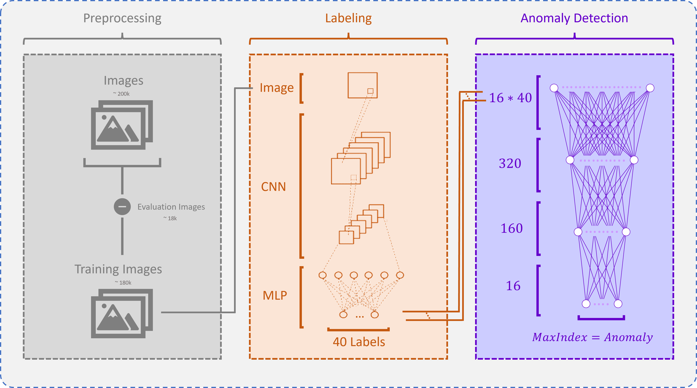

# Find Wally
The problem this repo tackles is the one described on the datathon page here: [https://www.kaggle.com/competitions/lumos-datathon/leaderboard](https://www.kaggle.com/competitions/lumos-datathon/leaderboard)

# Final Submission
Here is what the overview of our final submission looks like:

Our general approach was to reconstruct the labels, and later use the predicted probabilities of those labels to predict the outlier

# Preprocessing
We removed the evaluation images from the dataset as to not introduce leakage, otherwise we did not perform any data augmentation as there was no need for
further robustness because the evaluation data behaves just like the training data and 180.000 images already is a lot of images to process.

# Labeling
We finetuned a resnet34 to predict the probabilities for the 40 labels for each image. In this part we introduce leakage for the
downstream neural network that predicts the anomaly, which could be removed with little extra work,
but the anomaly detection neural network is not the main concern in this problem, it is the labeling model.
And since the evaluation images are not in there, it is still *legal* to do this.

# Anomaly Detection
Finally, the labels of a batch of 16 images is predicted and concatenated and fed into a neural network that has the 
index of the anomaly as a target. Just like the labeling model, we train this on all the training images that we have.

# Inference
We infer the label-probabilities for all the images in the evaluation set and then feed the image batches
into the anomaly detection neural network to get the index of the anomaly and get a submission for the datathon.